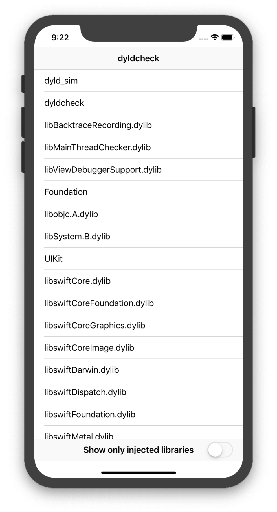

# DyldCheck

This application tries to detect external loaded libraries by whitelisting legit preloaded libraries. However in a real case would be better to implement a blacklist of banned libraries like Substrate, Substitute an so on due to the false positives that the whitelisting approach could have with each major iOS update and library updates.



It is recommended to check for external injected libraries when some important method is called, for instance, when generating a RSA key. A dyld could not be loaded at the beginning of the application's execution while being injected some time later.

## Obtaining loaded libraries

The code to obtain runtime loaded libraries is pretty simple as it only has to iterate calling _dyld_get_image_name

```swift
import MachO

func getLibs() -> [String]{
    let nlibs = _dyld_image_count();

    var array = [String]()
    for n in 0...(nlibs-1) {
        let name = String(validatingUTF8: _dyld_get_image_name(n)!)!
        array.append(name)
    }
    return array
}
```

## Whitelisting

In order to whitelist libraries it is required to run the application in all different kinds of non-compromised devices to see wether new libraries appear and lower the chance of running into false positives that could be fatal.

## TODO:

1. Dump all the libraries in multiple devices to add to the whitelist
